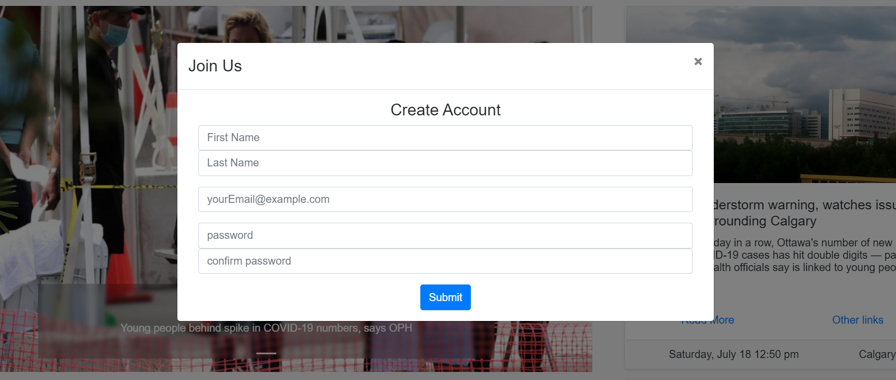
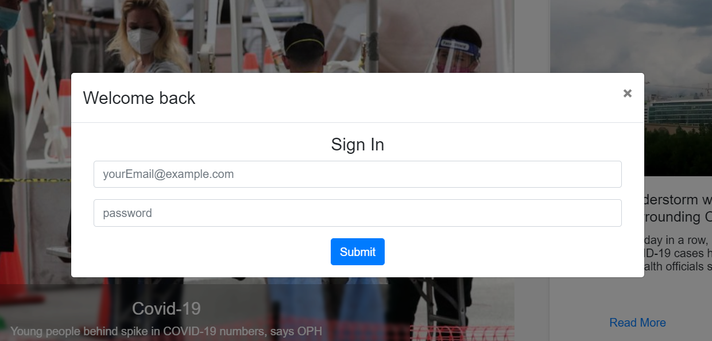

OuterCircles (News and blogs)
=============================

**_Contents:_**
- [About](#about)
- [Author](#authors)
- [Features](#features)

# About

OuterCircles is a modern blogging and news web application that allows users read and write on their favourite topics. This web app is inspired from Medium.com aims to implement its the features.

**Technology Stack**
- *Front End*: React/Redux, Bootstrap
- *Back End*: Node, Express, MongoDB on the cloud, SendGrid for Emails, Twilio for text messaging
- *Live API Documentation*: Swagger

# Author

[Kunal Dhawan](https://github.com/kunal-93)
[Priyanka Thakur](https://github.com/pthakur17)

# Features (Work in progress)
- Session Management
- Admin Login - Has access to add, update, remove a post
- User Registration
- User Login
- User profile
- Write article
- Share post
- Like, comment on posts
- Welcome Email after registration
- Live API documentation by swagger

# Screenshots
## Registration

## Login

## Landing Page
<kbd>
    
</kbd>
<kbd>
    
</kbd>
<kbd>
    
</kbd>

## Responsive Design
<kbd>
    
</kbd>
<kbd>
    
</kbd>
<kbd>
    
</kbd>
<kbd>
    
</kbd>

Installation
------------

Install the by running:
1. clone the repo
2. npm i
5. run the code - npm start

# documentation - powered by Swagger
----------

Contribute
----------

- Issue Tracker: https://github.com/kunal-93/outerCircles/issues
- Source Code: https://github.com/kunal-93/outerCircles

Coming Soon
----------

- User profile Page
- Write a post
- Comment on a post
- Like, share, vote a post